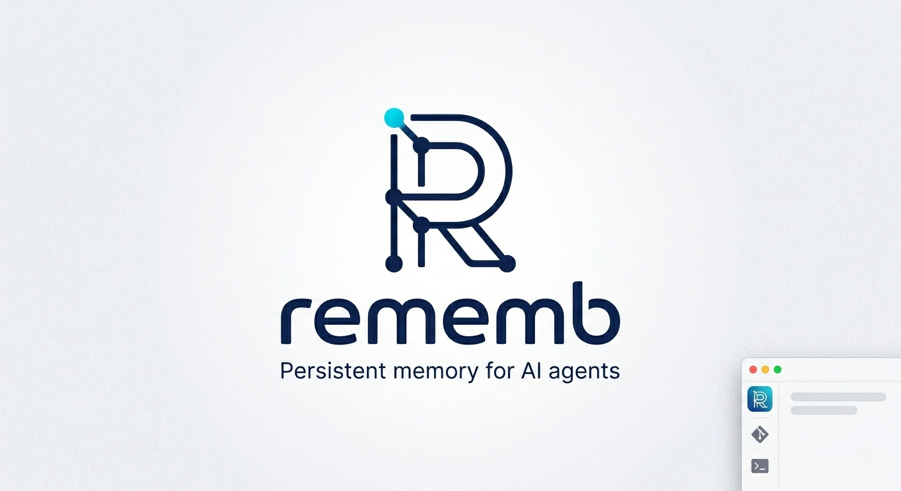
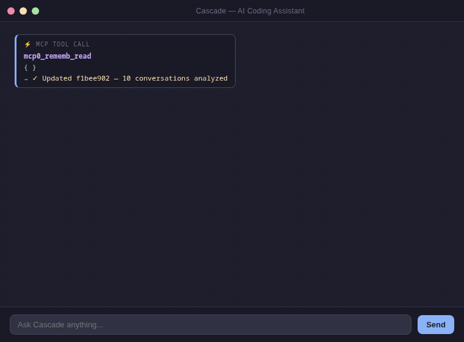
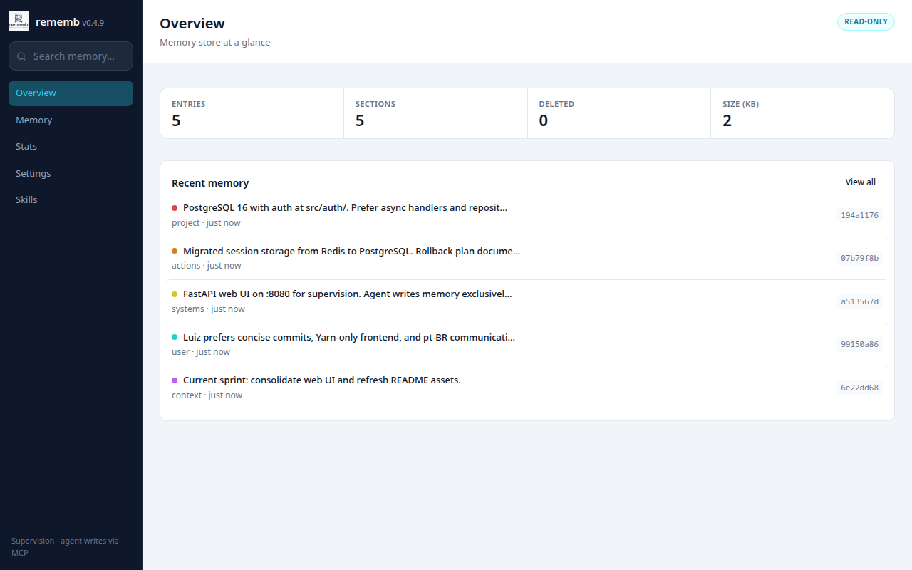
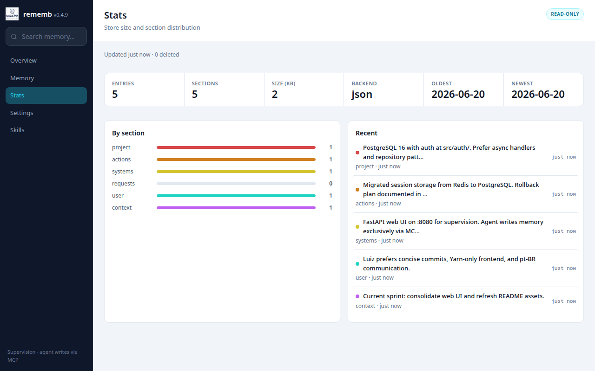
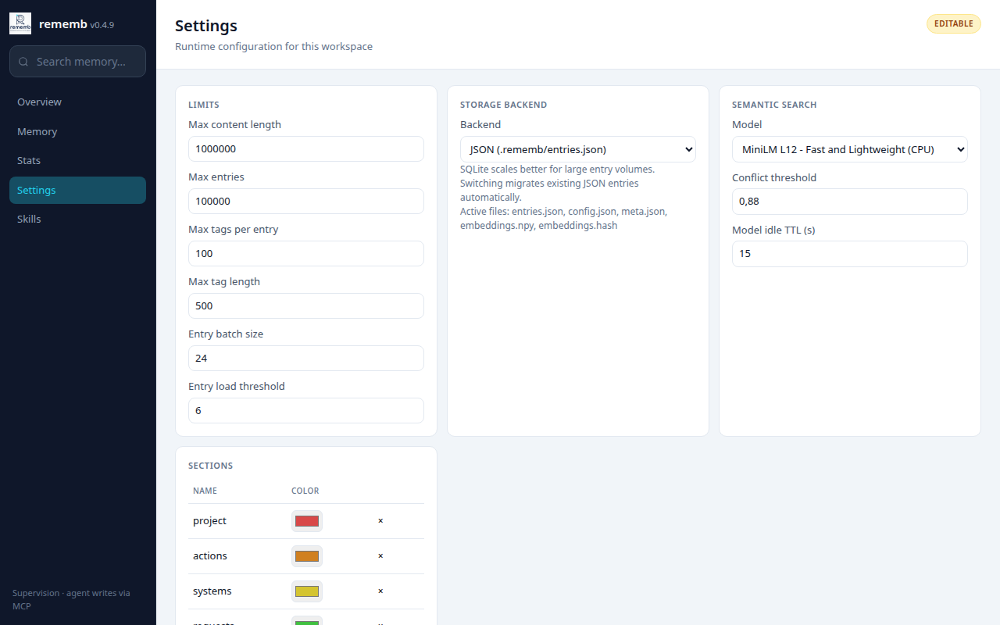
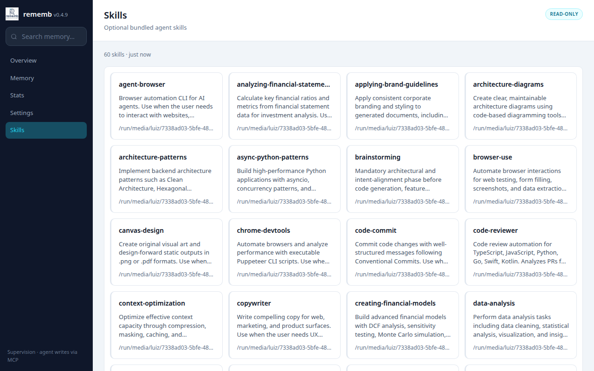

<!-- mcp-name: io.github.LuizEduPP/rememb -->


[](https://glama.ai/mcp/servers/LuizEduPP/Rememb)
[](https://lobehub.com/mcp/luizedupp-rememb)

Operate AI agents without losing context between sessions. `rememb` is a local-first persistent memory layer: structured entries, semantic search, versioning, diff, restore, and audit trail — no cloud service required.


---

## The problem

Teams using agents at real velocity rarely fail because they lack generation. They fail because operating agents every day creates context debt:

- too much re-explaining project facts every session
- too little durable memory outside the chat window
- too little audit trail for why something changed
- too much noise when recalling the right context

Every team or solo developer operating agents professionally hits this wall:

```
Session 1: "We're using PostgreSQL, auth at src/auth/, prefer async patterns."
Session 2: Agent starts from zero. You explain everything again.
Session 3: Same thing.
```

Existing solutions often center on hosted memory layers, API keys, or opaque context pipelines.
What you actually need is to **resume the next session with the minimum correct context and a trail you can inspect**.

`rememb` is built around four memory problems:

- durable facts and decisions instead of session-only chat memory
- semantic search instead of rereading everything
- non-destructive versioning instead of silent overwrites
- local-first audit trail for AI work, not opaque cloud logs

---

## Install

```bash
pip install rememb
```

---

## Quick Start

### With MCP (recommended)

Zero friction. No CLI commands. Native IDE integration.

**1. Add to your IDE's MCP config:**

```json
{
  "mcpServers": {
    "rememb": {
      "command": "rememb",
      "args": ["mcp"]
    }
  }
}
```

**2. Restart your IDE.**

The agent can read stored context at session start, write durable memory when something changes, and search only when targeted recall is needed.

If you want rememb usage to stay consistent, add a rememb-specific instruction block in your IDE custom instructions or in the MCP client prompt that wraps the agent. The point is to make the agent route reads, writes, search, recovery, and maintenance through rememb instead of ad hoc prompt memory.

You can place that block in either of these places:

- IDE-level custom instructions
- the system prompt or instruction field of the MCP client that is calling rememb

In both cases, keep the scope explicit: these rules are about how the agent should use rememb, not about replacing the rest of your coding instructions.

For the exact copy-paste block, use the canonical rules section in [MCP_TOOLS.md](MCP_TOOLS.md#recommended-agent-rules).

No extra storage setup, server config, or schema migration is required. In MCP mode, rememb resolves storage home-first and auto-initializes `~/.rememb` when needed.

For the current public MCP tool list and descriptions, see [MCP_TOOLS.md](MCP_TOOLS.md).

If you want multiple MCP clients on the same machine to reuse one already-running rememb process, start a persistent local SSE transport:

```bash
rememb mcp --transport sse --host 127.0.0.1 --port 8765
```

This keeps one MCP process alive, so repeated clients can hit the same loaded embedding model through `http://127.0.0.1:8765/sse` and `http://127.0.0.1:8765/messages/`.

Do not put `--transport sse` inside a stdio MCP client config. `stdio` clients expect JSON-RPC on stdin/stdout; the SSE mode exposes an HTTP endpoint and must be started separately.

### Local usage without MCP

```bash
rememb                    # Open the web UI (http://localhost:8080)
rememb --port 9000        # Custom port
rememb fetch-model        # Download the local embedding model for semantic search
```

---

## How it works

```
.rememb/
  entries.json   ← default JSON store (or entries.db with SQLite backend)
  meta.json      ← project metadata
  config.json    ← limits, sections, storage backend, semantic model settings
```

A local JSON-backed store in your project. Your agent can read prior decisions, search by meaning, update entries without losing history, and restore previous versions without depending on a cloud memory service.

```
User: "We're using PostgreSQL, auth at src/auth/, async patterns"
Agent: [rememb_write] → Saved

[New session]
Agent: [rememb_read]  → Context loaded
Agent: "I see you're using PostgreSQL with auth at src/auth/..."
```
These map to rememb_write, rememb_edit, and rememb_delete respectively. For the current public MCP tool list and descriptions, see [MCP_TOOLS.md](MCP_TOOLS.md).

Search uses local semantic embeddings (no API, no cloud). The embedding model is unloaded after a short idle window by default, so the process does not keep the full model resident forever.

rememb now writes the full configuration set to .rememb/config.json during initialization, so all supported knobs live in one place:

```json
{
  "max_content_length": 1000000,
  "max_tag_length": 500,
  "max_tags_per_entry": 100,
  "max_entries": 100000,
  "sections": ["project", "actions", "systems", "requests", "user", "context"],
  "section_colors": {
    "project": "#d84848",
    "actions": "#d08020"
  },
  "entry_batch_size": 24,
  "entry_load_threshold": 6,
  "semantic_model_idle_ttl_seconds": 15,
  "semantic_model_name": "paraphrase-multilingual-MiniLM-L12-v2",
  "semantic_conflict_threshold": 0.88,
  "storage_backend": "json"
}
```

Set `storage_backend` to `sqlite` for larger stores. The Web UI and MCP migrate existing JSON entries automatically when you switch backends.

Set semantic_model_idle_ttl_seconds to 0 to unload the model immediately after each semantic operation. If you want a smaller model, you can switch semantic_model_name to another SentenceTransformers model such as intfloat/multilingual-e5-small or all-MiniLM-L6-v2.

entry_batch_size and entry_load_threshold control pagination in the web UI — how many cards load at once and when to trigger "load more".

Section names are normalized to lowercase, duplicates are ignored after normalization, and removing a section with existing entries automatically migrates those entries to `uncategorized`. `meta.json` is kept in sync with the current effective section list.

Environment overrides are also available: REMEMB_SEMANTIC_MODEL_IDLE_TTL_SECONDS and REMEMB_SEMANTIC_MODEL_NAME.

---

## Memory sections

| Section | What to store |
|---------|---------------|
| `project` | Tech stack, architecture, goals |
| `actions` | What was done, decisions made |
| `systems` | Services, modules, integrations |
| `requests` | User preferences, recurring asks |
| `user` | Name, style, expertise, preferences |
| `context` | Anything else relevant |

---

## Web UI

`rememb` includes a local web interface for **supervision** — browse memory, inspect history, and tune runtime settings. The agent writes memory through MCP; the web UI is read-only for entries.

```bash
rememb                       # Open the web UI (http://localhost:8080)
rememb --host 0.0.0.0        # Bind to all interfaces
rememb --port 9000           # Custom port
rememb --no-browser          # Start server without opening the browser
```



Overview with entry totals and recent memory activity.



Stats with totals, section breakdown, date range, and recent entries.



Settings for limits, storage backend, semantic search, section colors, and maintenance actions.



Skills browser for the optional `rememb-skills` package (`pip install rememb-skills` or `pip install rememb[skills]`).

Views:
- **Overview** — entry totals, deleted count, store size, and recent memory
- **Memory** — browse, search, filter by section, sort, and include deleted entries
- **Stats** — totals, backend, section bars, oldest/newest timestamps, and recent entries
- **Settings** — edit limits, storage backend, semantic search, section colors, consolidate duplicates, and save runtime config
- **Skills** — browse bundled agent skills when `rememb-skills` is installed

Entry inspection from the UI includes version history, side-by-side diff, and restore actions. Writes and edits stay on the MCP side.

The semantic search MCP tool also accepts an optional exact `tag` filter, so IDE clients can restrict semantic matches before ranking.

---

## CLI

```bash
rememb                                                      # Open the web UI (http://localhost:8080)
rememb --host 0.0.0.0 --port 8080 --no-browser             # Custom bind, no auto-open
rememb mcp                                                  # Start MCP server over stdio
rememb mcp --transport sse --host 127.0.0.1 --port 8765    # One persistent local MCP process
rememb fetch-model                                          # Download the local embedding model
rememb --version, -v                                        # Show version
rememb --help, -h                                           # Show help
```

---

## Compatibility

The current compatibility surface is tracked explicitly in [COMPATIBILITY.md](COMPATIBILITY.md).

Short version:

- Python 3.10 to 3.12 are covered by CI
- CLI contract and MCP tool schema have automated test coverage
- stdio MCP is the primary documented integration path
- SSE MCP is documented, but not yet covered by end-to-end automated client tests
- release automation and Trusted Publishing are documented in [RELEASE.md](RELEASE.md)

---

## Design

- **Local first** — plain JSON file in your project
- **Portable** — copy `.rememb/` anywhere, it works
- **Agnostic** — any agent, any IDE (MCP or CLI)
- **No lock-in** — no servers, no API keys, no accounts

Core capabilities:

- structured memory with sections and tags
- semantic search with local embeddings
- non-destructive versioning, diff, restore, and soft delete
- duplicate consolidation and store stats
- config and maintenance via Web UI (settings only; entry writes via MCP)
- optional bundled skills via `rememb-skills` and MCP

---

## Contributing

```bash
git clone https://github.com/LuizEduPP/Rememb
cd rememb
pip install -e ".[dev]"
```

PRs welcome. Issues welcome. Stars welcome. 🌟

---

## License

MIT
